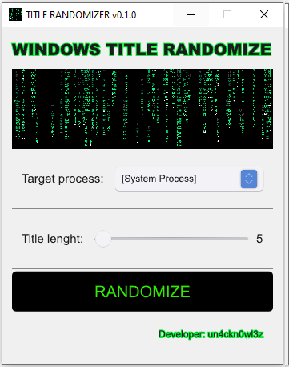
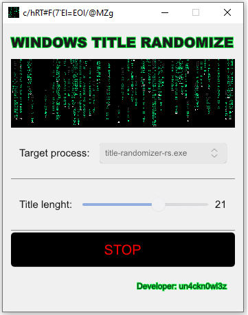

# Windows Title Randomizer
<b>Windows Title Randomizer</b> is a lightweight utility written in Rust with a modern GUI powered by Slint. It allows you to select a target process and randomize or change its window title on the fly.

